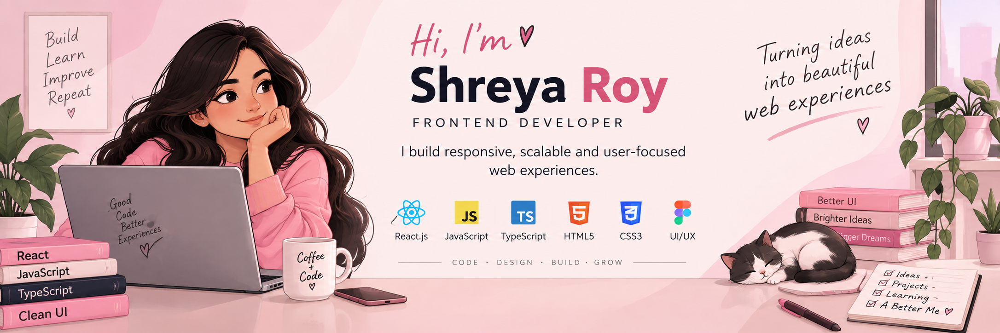

<p align="center">
  
</p>

<p align="center">
  <a href="https://www.linkedin.com/in/shreya-roy-in">
    
  </a>
  <a href="https://github.com/shreya-roy-git">
    
  </a>
  
</p>

<h3 align="center">I build responsive, scalable and user-focused web experiences.</h3>

<p align="center">
  Frontend Developer working primarily with React.js, JavaScript and TypeScript.<br/>
  I enjoy turning product requirements and ideas into clean, reusable and intuitive interfaces.
</p>

---

## 👩‍💻 What I Build

<table>
  <tr>
    <td width="50%" valign="top">
      <h3>⚛️ React Applications</h3>
      Component-driven web applications built with React.js, React Hooks and reusable UI patterns.
    </td>
    <td width="50%" valign="top">
      <h3>🎨 Responsive Interfaces</h3>
      Clean and responsive interfaces designed to work across different screen sizes and browsers.
    </td>
  </tr>
  <tr>
    <td width="50%" valign="top">
      <h3>🔌 API-Driven Experiences</h3>
      Frontend applications integrated with REST APIs and backend services to deliver interactive experiences.
    </td>
    <td width="50%" valign="top">
      <h3>🧩 Reusable UI</h3>
      Maintainable component-based interfaces using modern UI libraries and consistent design patterns.
    </td>
  </tr>
  <tr>
    <td width="50%" valign="top">
      <h3>🧪 Testing & Debugging</h3>
      Functional testing, UI validation, browser testing and systematic debugging to improve application reliability.
    </td>
    <td width="50%" valign="top">
      <h3>🤖 AI & Automation</h3>
      Exploring AI-powered applications, developer tools, automation and ways to improve development workflows.
    </td>
  </tr>
</table>

---

## 🛠️ Technology Radar

<p align="center">
  
</p>

<p align="center">
  
  
  
  
  
</p>

```text
Frontend                React.js · JavaScript · TypeScript · JSX
UI & Styling            HTML5 · CSS3 · Material UI · Chakra UI · Bootstrap
React                   React Hooks · Components · Component Architecture
APIs                    REST APIs · JSON · API Integration
Responsive Development  Responsive Web Design · Cross-Browser Compatibility
Testing                 Functional Testing · UI Testing · Browser Testing
Debugging               Chrome DevTools · Troubleshooting · Code Debugging
Version Control         Git · GitHub
Development             VS Code · Linux
Methodology             Agile · Scrum · Requirements Gathering
```

---

## ⚛️ Frontend Engineering

My approach to frontend development focuses on creating interfaces that are:

```text
Simple
  ↓
Reusable
  ↓
Responsive
  ↓
Maintainable
  ↓
Performant
  ↓
User-focused
```

I enjoy working across the frontend development lifecycle:

- Understanding requirements
- Translating designs into interfaces
- Building reusable React components
- Managing application behavior with React Hooks
- Integrating REST APIs
- Implementing responsive layouts
- Testing frontend functionality
- Debugging browser and UI issues
- Improving usability and performance

---

## 🎨 UI & Design

I enjoy creating interfaces that balance functionality with usability.

### UI Technologies

- Material UI
- Chakra UI
- Bootstrap
- HTML5
- CSS3
- Responsive Web Design

### UI Focus

- Responsive layouts
- Component reusability
- Cross-browser compatibility
- User experience
- Usability
- Interactive interfaces
- UI consistency
- Performance-focused interfaces

---

## 🔌 API Integration

I work with frontend applications that communicate with backend services through REST APIs.

```text
React UI
   ↓
User Interaction
   ↓
Application Logic
   ↓
REST API
   ↓
Backend Service
   ↓
Response / JSON
   ↓
React UI Update
```

Areas I work with include:

- REST API integration
- JSON data handling
- Frontend-backend integration
- API-driven UI
- Error handling
- Debugging API-related issues

---

## 🧪 Testing & Debugging

Building a feature is only part of the process.

I also focus on validating how the application behaves across different scenarios.

```text
Develop
   ↓
Test
   ↓
Identify Issue
   ↓
Debug
   ↓
Fix
   ↓
Validate
```

Experience includes:

- Functional testing
- UI testing
- Browser testing
- Cross-browser validation
- Chrome DevTools
- Debugging frontend issues
- Application troubleshooting
- UI quality assurance

---

## 🚀 Projects & Experiments

My repositories are a place where I build, experiment and learn.

### ⚛️ React Projects

Applications exploring:

- React.js
- Reusable components
- React Hooks
- Responsive UI
- API integration
- Interactive experiences

### 🤖 AI Experiments

Projects exploring the intersection of:

- AI
- Web applications
- Automation
- Developer productivity
- Intelligent user experiences

### 🧪 Testing & Automation

Experiments around:

- End-to-end testing
- Browser automation
- Automated workflows
- Developer tooling
- Quality engineering

---

## 🧠 Currently Exploring

- Advanced React.js patterns
- TypeScript
- Frontend architecture
- Component design
- Performance optimization
- Automated testing
- AI-powered applications
- Developer productivity tools

---

## 🌱 Development Philosophy

> **Build with purpose.  
> Keep it simple.  
> Make it reusable.  
> Keep learning.**

Good frontend development is more than making a page look right.

It is about creating an experience that is **easy to use, responsive across devices, maintainable for developers, and reliable for users.**

---

## 📫 Connect

<p align="center">
  <a href="https://github.com/shreya-roy-git">
    
  </a>
  <a href="https://www.linkedin.com/in/shreya-roy-in">
    
  </a>
</p>

<p align="center">
  Thanks for stopping by! 👋
</p>
